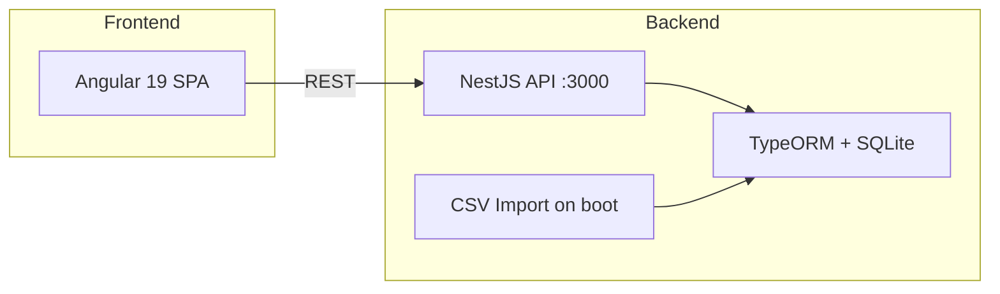

# Golden Raspberry Awards Dashboard

> Full-stack technical challenge — NestJS API + Angular SPA analyzing the worst films in cinema history.

[](https://nestjs.com)
[](https://angular.dev)
[](https://www.typescriptlang.org)
[](https://docker.com)
[](https://jestjs.io)

---

## Overview

Dashboard for the **Golden Raspberry Awards** (Razzies) — the annual parody award honoring the worst in film. Built as a full-stack hiring challenge with complete local API, no external dependencies required.

**Backend:** NestJS + TypeORM + SQLite (in-memory)  
**Frontend:** Angular 19 + Tailwind CSS 4 + Flowbite

---

## Features

### Dashboard
- Years with multiple winners
- Top 3 studios by win count
- Producer award intervals (min/max)
- Search winners by year

### Movies
- Paginated movie list
- Filter by year and winner status

### API (local)
- `GET /movies` — paginated list
- `GET /movies/yearsWithMultipleWinners`
- `GET /movies/studiosWithWinCount`
- `GET /movies/winnersByYear?year=1986`
- `GET /producers/intervals` — min/max producer intervals

---

## Architecture



---

## Quick Start

### Option 1 — Docker (recommended)

```bash
git clone https://github.com/jonathasribeiro/golden-raspberry-awards-list.git
cd golden-raspberry-awards-list
docker compose up --build
```

- **API:** http://localhost:3000  
- **Frontend:** http://localhost:4200

### Option 2 — Local

**Backend**
```bash
cd backend
npm install
npm run start:dev
```

**Frontend** (new terminal)
```bash
cd frontend
npm install
npm start
```

---

## Project Structure

```
├── backend/
│   ├── src/
│   │   ├── movies/          # Entity, service, controller
│   │   ├── producers/       # Interval analysis
│   │   └── assets/          # movielist.csv
│   └── Dockerfile
├── frontend/
│   ├── src/app/
│   │   ├── pages/           # dashboard, movies
│   │   └── services/        # API clients
│   └── Dockerfile
└── docker-compose.yml
```

---

## Testing

```bash
# Backend unit tests
cd backend && npm run test:unit

# Backend e2e
cd backend && npm run test:e2e

# Frontend (Karma + Jasmine)
cd frontend && npm test
```

---

## Data Source

Movies are loaded from `backend/src/assets/movielist.csv` on application bootstrap (Golden Raspberry Awards historical data).

---

## Author

**Jonathas Ribeiro** — Senior Fullstack Engineer  
[LinkedIn](https://www.linkedin.com/in/jonathasribeiroreal) · [GitHub](https://github.com/jonathasribeiro)
